# Student Attendance Management System Using Raspberry Pi [SAMS]
---

IoT-Based Student Attendance Management System using Raspberry Pi, RFID Card Reading, Web-Based Management, and Real-Time Attendance Tracking.

---

### Login Page
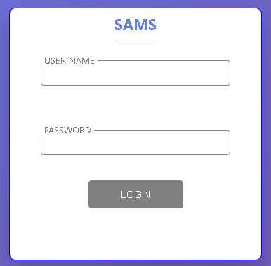

### Dashboard
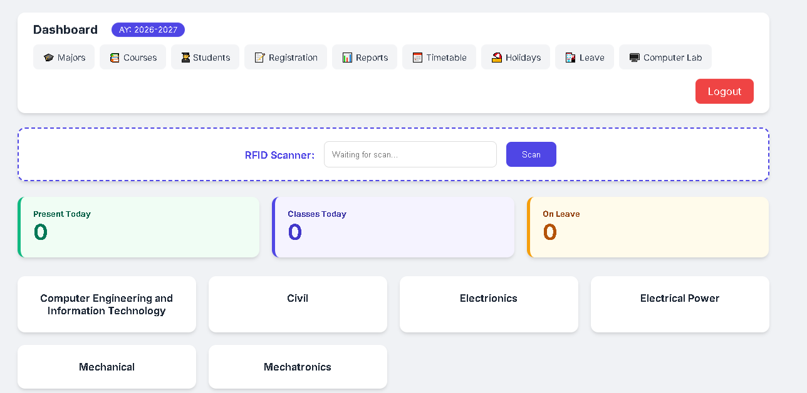

### Manage Majors
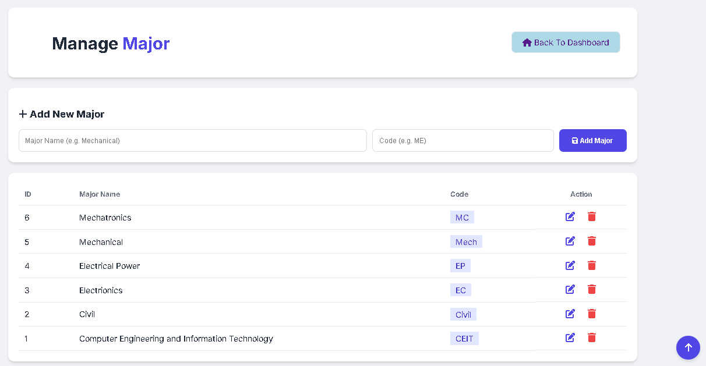

### Manage Courses
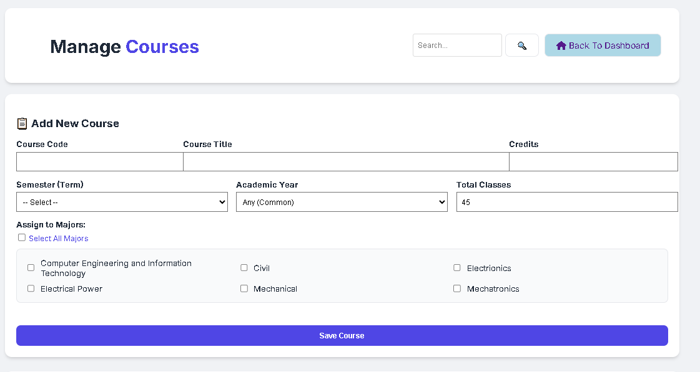

### Manage Students
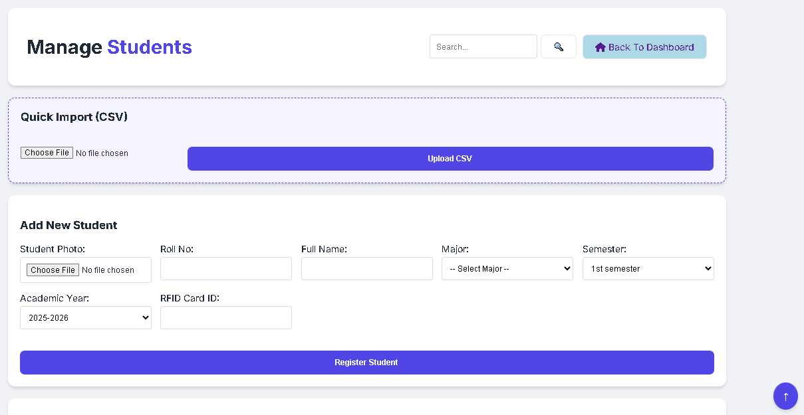

### Manage Course Registration
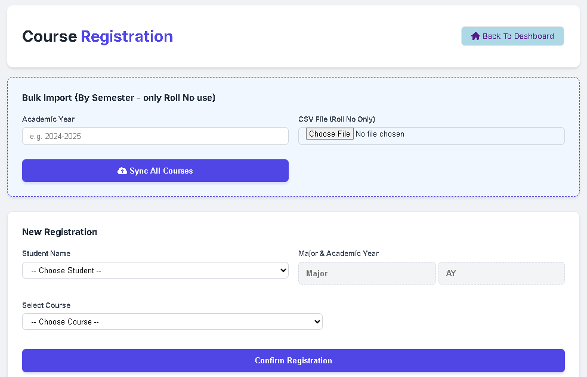

### Manage Reports
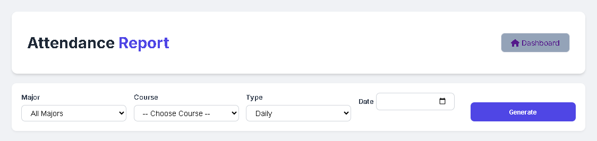

### Manage Timetable
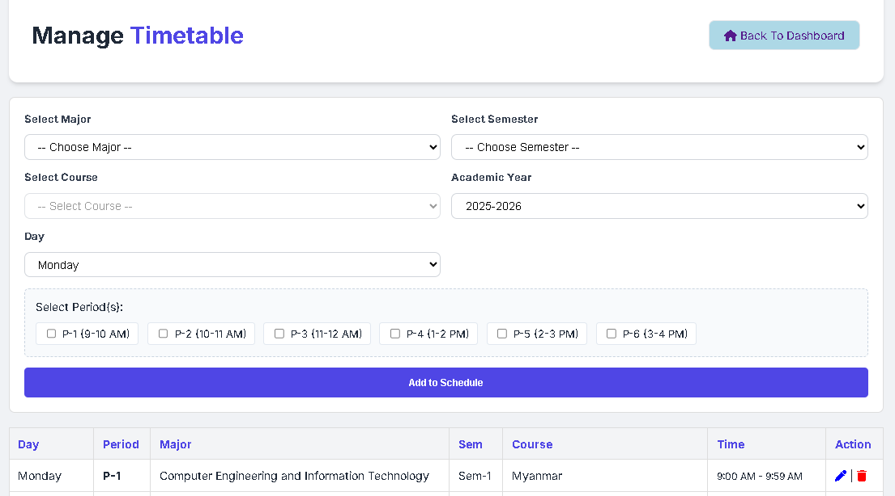

### Manage Holidays
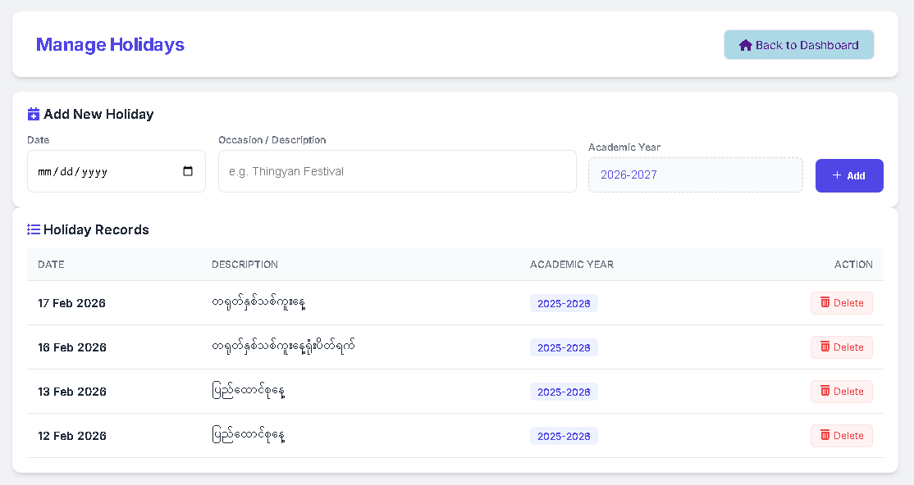

### Manage Leave
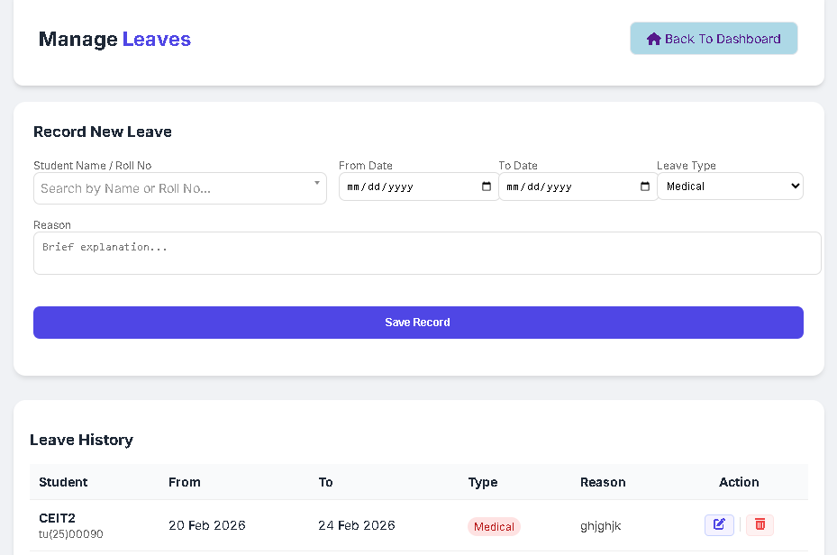

### Computer_Lab_Usage_Record
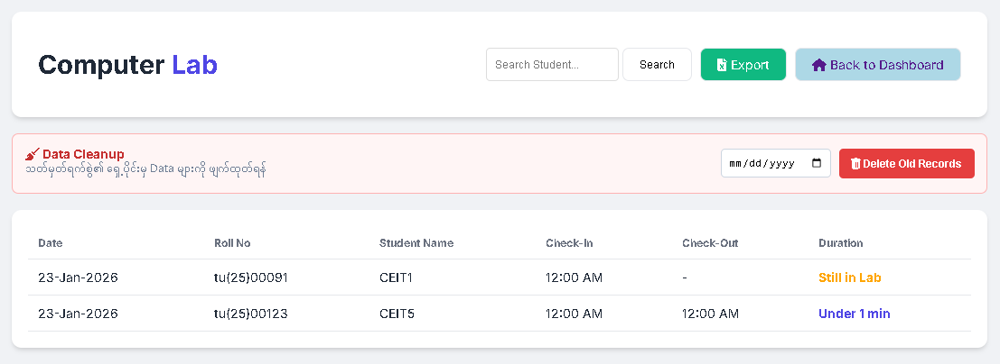

### System Architecture
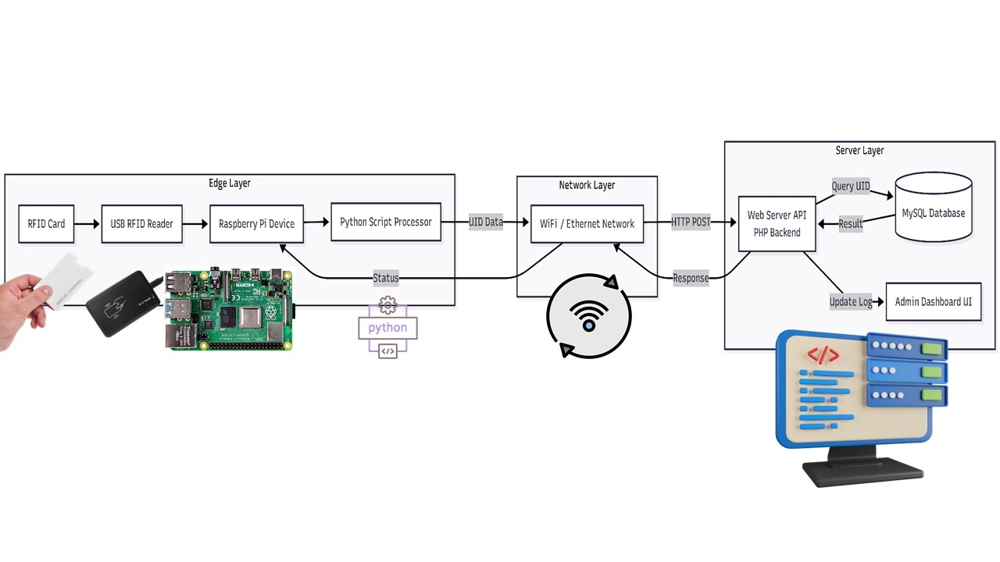

---

## Overview

Student Attendance Management System (SAMS) သည် နည်းပညာတက္ကသိုလ်များအတွက် Attendance ခေါ်ယူခြင်းကို Digitalized ပြုလုပ်နိုင်ရန် IoT, Web Technologies နှင့်ပေါင်းစပ်တည်ဆောက်ထားသော စနစ်ဖြစ်ပါတယ်။

ကျောင်းသားများသည် RFID Card ကို Raspberry Pi နှင့်ချိတ်ဆက်ထားသော RFID Reader တွင် ကပ်ဖတ်ပြီး Attendance ကို အလိုအလျောက် စာရင်းသွင်းနိုင်ပါတယ်။
ပြီးလျှင် Web Dashboard မှတစ်ဆင့် ကျောင်းသားများ၏ Attendance ကို နေ့စဉ်၊ လစဉ် Report များအဖြစ် ပြန်လည်ကြည့်ရှုနိုင်ပါတယ်။

Admin ဘက်မှ ကျောင်းသားစာရင်းများ၊ ဘာသာရပ် (Course_registration) များ၊ Web Dashboard မှတစ်ဆင့် စီမံခန့်ခွဲနိုင်ပါတယ်။

ထို့အပြင် Raspberry Pi အခြေပြု RFID Card Reading System ကို အသုံးပြုထားပြီး ကျောင်းသားများ၏ Card ကိုဖတ်သည်နှင့် သက်ဆိုင်ရာ Course/Class အတွက် Attendance ကို အလိုအလျောက် မှတ်သွင်းပေးနိုင်ပါတယ်။

---

## System Workflow

### 1. Student Registration

* Admin/Teacher က Student Details ကို Web Dashboard မှ ထည့်သွင်းနိုင်ပါတယ်။
* ကျောင်းသားတစ်ဦးချင်းစီအတွက် Roll No, Name, Major, Current Semester နှင့် RFID Card ID သတ်မှတ်ပေးရပါမယ်။

### 2. Course Management

* Admin/Teacher က Course များကို ထည့်သွင်းနိုင်ပါတယ်။
* Course ခေါင်းစဉ်၊ Session/Term နှင့် Major အတိုင်း သတ်မှတ်ပေးရပါမယ်။

### 3. Course Assignment

* Major တစ်ခုချင်းစီအတွက် မည်သည့် Course များ သင်မည်ကို သတ်မှတ်ပေးရပါမယ်။

### 4. Attendance Marking (RFID)

* ကျောင်းသားက သူ၏ RFID Card ကို RFID Reader ပေါ်ကပ်ပါမယ်။
* Raspberry Pi က Card ID ကိုဖတ်ပြီး Database ရှိ ကျောင်းသားနှင့် ကိုက်ညီမှုရှိမရှိ စစ်ဆေးပါမယ်။
* ကိုက်ညီပါက ယနေ့ရက်စွဲအတွက် Attendance ကို မှတ်သွင်းပေးပါမယ်။

### 5. Attendance Report

* Admin/Teacher က Web Dashboard မှ Daily Report သို့မဟုတ် Monthly Report ကို ပြန်လည်ကြည့်ရှုနိုင်ပါတယ်။
* ကျောင်းသားတစ်ဦးချင်းစီ၏ Attendance ကို Filter လုပ်၍ ကြည့်ရှုနိုင်ပါတယ်။

---

## Admin / Teacher Features

### Student Management

* Add Students
* Update Students
* Delete Students
* Assign RFID Card ID
* View Student List

### Course Management

* Add Courses
* Update Courses
* Delete Courses
* Set Course Session/Term

### Course Assignment

* Assign Courses to Major
* Remove Course Assignment
* View Assigned Courses

### Attendance Management

* View Daily Attendance
* View Monthly Attendance
* Filter by Student
* Filter by Course
* Filter by Date Range

### Report Generation

* Daily Attendance Report
* Monthly Attendance Report
* Export to PDF (Optional)
* Print Report

### User Authentication

* Admin Login
* Teacher Login
* Secure Logout

---

## Student Features

* RFID Card Scanning
* Automatic Attendance Marking
* View Personal Attendance (if student access is enabled)

---

## Hardware Features

* RFID Card Reading (RC522)
* Real-Time Attendance Marking
* LCD Display for Status Messages
* Buzzer Notification for Successful/Failed Scan
* LED Indicators

---

## Technologies Used

### Software

* PHP (Native)
* MySQL
* HTML5
* CSS3
* JavaScript
* Bootstrap
* AJAX
* XAMPP / Apache

### Hardware

* Raspberry Pi (3B+ / 4)
* RFID Module (RC522)
* 16x2 LCD Display
* Buzzer
* LED (Red/Green)
* Jumper Wires
* Breadboard

---

## Database Structure

### Major Details Table (major_details)
| Column | Type | Description |
|--------|------|-------------|
| id | INT | Primary Key |
| title | VARCHAR | Major Name (e.g., Computer Science) |

### Student Details Table (student_details)
| Column | Type | Description |
|--------|------|-------------|
| roll_no | VARCHAR | Primary Key |
| name | VARCHAR | Student Name |
| major_id | INT | Foreign Key (major_details.id) |
| current_semester | VARCHAR | Current Semester (e.g., 1, 2, 3) |
| rfid_uid | VARCHAR | RFID Card Unique ID |

### Session Details Table (session_details)
| Column | Type | Description |
|--------|------|-------------|
| id | INT | Primary Key |
| title | VARCHAR | Session Name |
| term | VARCHAR | Term/Semester |

### Course Details Table (course_details)
| Column | Type | Description |
|--------|------|-------------|
| id | INT | Primary Key |
| title | VARCHAR | Course Name |
| session_id | INT | Foreign Key (session_details.id) |

### Course Assignments Table (course_assignments)
| Column | Type | Description |
|--------|------|-------------|
| id | INT | Primary Key |
| major_id | INT | Foreign Key (major_details.id) |
| course_id | INT | Foreign Key (course_details.id) |

### Attendance Table (attendance)
| Column | Type | Description |
|--------|------|-------------|
| id | INT | Primary Key |
| roll_no | VARCHAR | Foreign Key (student_details.roll_no) |
| course_id | INT | Foreign Key (course_details.id) |
| date | DATE | Attendance Date |
| status | ENUM | Present / Absent |

---

### License

This project is developed for educational and research purposes only.
All Rights Reserved.

The source code, documentation, design, and related materials များကို လေ့လာရန်အတွက် ကြည့်ရှုခွင့်ရှိသည်။
မည်သည့်အပိုင်းကိုမျှ မိတ္တူကူးခြင်း၊ ပြင်ဆင်ခြင်း၊ ပြန်လည်ဖြန့်ချိခြင်း၊ ထုတ်ဝေခြင်း သို့မဟုတ် စီးပွားဖြစ်အသုံးပြုခြင်း မပြုရ။
ခွင့်ပြုချက်မရှိဘဲ အသုံးပြုပါက တားမြစ်သည်။
